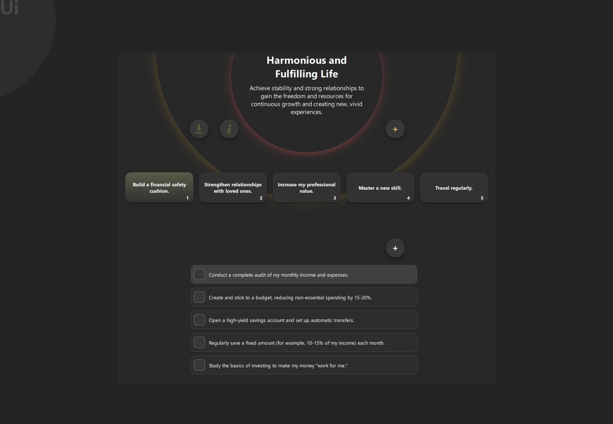
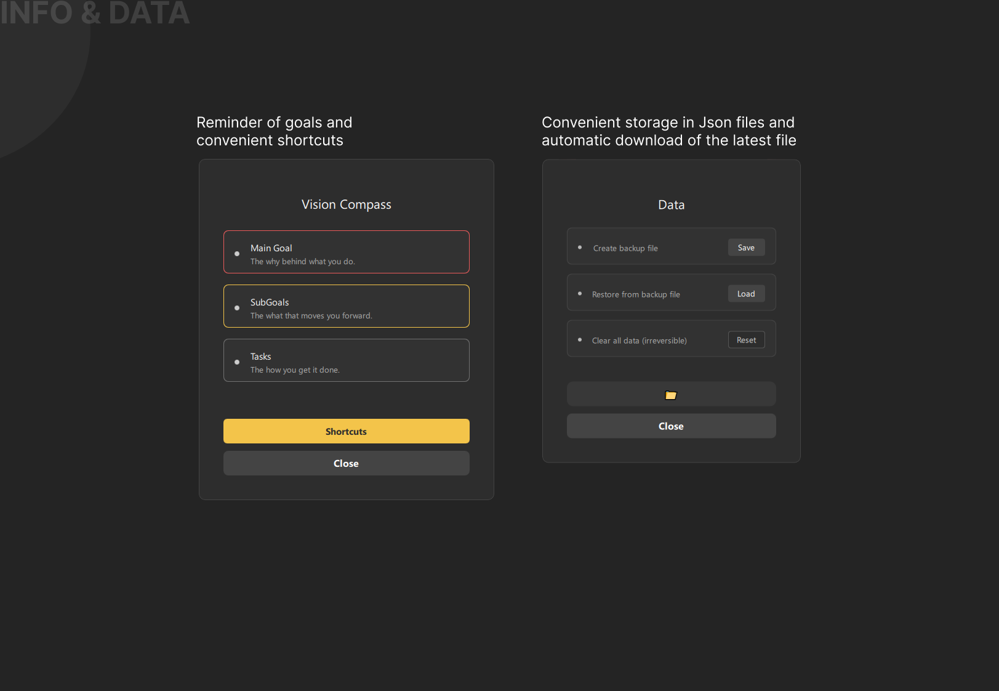

# 🧭 Vision Compass (Qt + C++)

A minimalist **goal and task navigation tool** built with **C++** and **Qt**. 
Unify your goals and objectives without losing context.

---

## ✨ Features

### Main Application View


### 01. Main Application View



### 02. Popups



### Design and ideology

[https://www.behance.net/gallery/234615767/VisionCompass-Software-Design]
---

## 🛠️ Build & Setup

The project uses **CMake** and requires **Qt6** components (Widgets, Qml, Quick, QuickControls2).

### 🔧 With CMake (Cross-Platform)

```bash
git clone [https://github.com/DmytroGio/vision-compass.git](https://github.com/DmytroGio/vision-compass.git)
cd vision-compass
mkdir build && cd build
cmake ..
cmake --build .

🧱 With Qt Creator (Recommended)
Open CMakeLists.txt in Qt Creator (Qt 6.9+ recommended).

Click Configure Project, then Build, and finally Run.

Click Configure Project

Click Build and then Run

🚀 Usage
Launch the application.

Set your main goal.

Add sub-goals (stages).

Select a sub-goal to add and complete tasks.

📄 License & Notes
License: MIT License.

Notes: Contributions and suggestions are welcome.