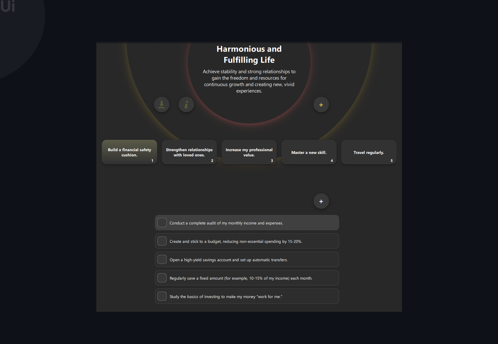
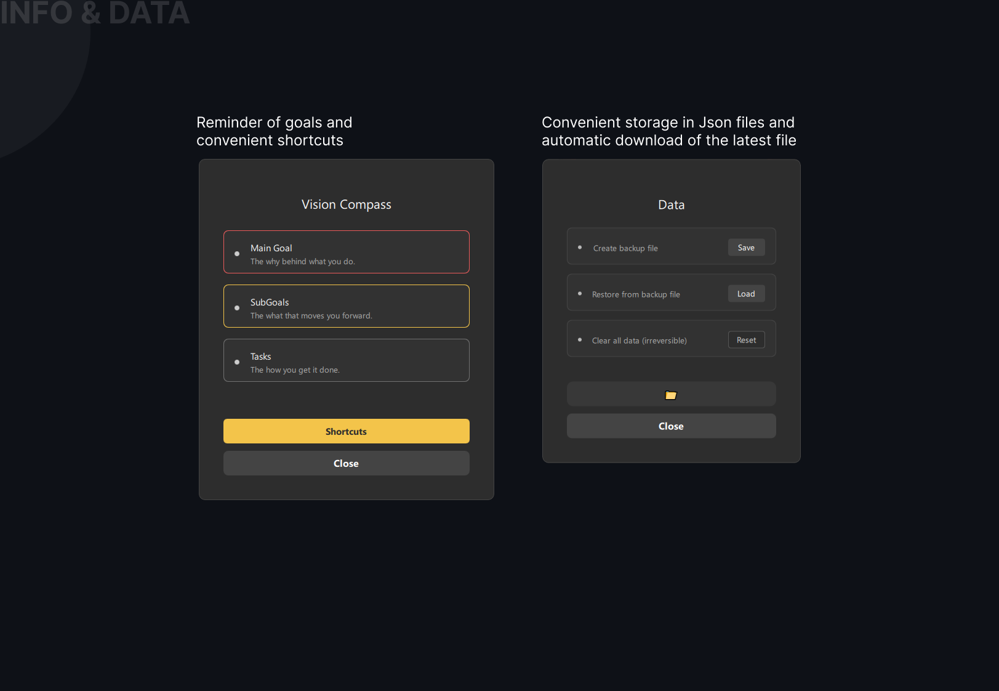

# Vision Compass

A minimalist goal and task navigation tool built with C++ and Qt6.


## Overview

Vision Compass helps you organize goals and tasks without losing context. Set main objectives, break them into manageable stages, and track progress systematically.

**Key Features:**
- Hierarchical goal organization
- Task management by stages  
- Context-aware navigation
- Clean, distraction-free interface

## Screenshots

### Main Interface


### Dialog Windows


## Design

Complete design concept: [VisionCompass on Behance](https://www.behance.net/gallery/234615767/VisionCompass-Software-Design)

## Build Instructions

### Requirements
- Qt6 (Widgets, Qml, Quick, QuickControls2)
- CMake 3.16+
- C++17 compatible compiler

### Using CMake
```bash
git clone https://github.com/DmytroGio/vision-compass.git
cd vision-compass
mkdir build && cd build
cmake ..
cmake --build .
```

### Using Qt Creator
1. Open `CMakeLists.txt` in Qt Creator
2. Configure Project
3. Build and Run

## Usage

1. Launch the application
2. Set your main goal
3. Add sub-goals (stages)
4. Select a sub-goal to manage tasks
5. Track progress and iterate

## Contributing

Issues, suggestions, and pull requests are welcome.

## License

MIT License